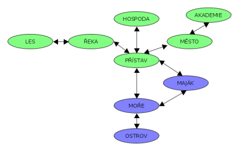

# 3. Plánování
## Zadání:
* Pomocí automatického plánování a plánovače ze cvičení vyřešte následující úlohu. Nutné je korektně namodelovat všechny možnosti ze zadání.
* Nahrajte všechny soubory do privátního gitlab repozitáře před odevzdáním na cvičení.
* Spolu s pddl soubory odevzdejte i výsledné plány.

Toto je jednoduchá mapka znázorňující svět, v němž se nachází hrdina našeho příběhu, prostý námořník (oplývající překvapivou zručností v mnoha řemeslech), který hledá štěstí. Jelikož je také chytrý, zamyslel se a dospěl k závěru, že bude šťastný jen v následujících případech:

* ožení se,
* stane se admirálem,
* dá se na kokain.

Úkolem je zjistit, kterou ze tří možností dosáhne svého štěstí nejrychleji; jeho pouť začíná v přístavu.

Jelikož loď dělá námořníka (a navíc mezi přístavem, majákem, mořem a ostrovem se jinak než na lodi pohybovat nelze), náš konkrétní, extrémně schopný námořník ji dokáže spíchnout z trochy dřeva takřka na koleni. S pomocí dřeva udělá člun, s pomocí člunu, dřeva a zlatého zrnka postaví fregatu. Na postavení karavely už potřebuje krom člunu a dřeva i zlatou minci. Při každé výrobě o všechny suroviny přijde.

Pokud má námořník alkohol, tak se taky může kdekoli trochu "dostat do nálady". Pokud už je nametený (tj. v náladě), s dalším alkoholem se může opít, a pokud si dá alkohol ještě jednou, stane se závislým. O alkohol samozřejmě přichází s každým vypitím.

Následuje seznam možných akcí ve všech lokacích:

### LES
V lese může námořník kácet dřevo, trhat květiny a porvat se s medvědem. Pokud u sebe má alkohol, může se setkat s kouzelným dědečkem (ve skutečnosti vysloužilým pirátem) a vyměnit alkohol za mapku k tajné skrýši na ostrově. Získá tím pochybné známosti.

### ŘEKA
Pokud se mu nechce kácet, může námořník jednoduše člun ukrást. Získá tím však záznam v trestním rejstříku. Může též rýžovat zlato, za což dostane jedno zlaté zrnko, případně si dopřát ledovou koupel a tím vystřízlivět (nikoliv zbavit se závislosti).

### PŘÍSTAV
V přístavu může námořník buď pracovat a získá tak jedno zlaté zrnko nebo obchodovat, má-li nějaké zboží: kokosy získané sběrem na ostrově, medvědí kůže po rvačce s medvědem - dostane za ně zlatou minci. Pokud už má nějaké pochybné známosti a má v držení aspoň jednu zlatou cihlu, může se seznámit s pašeráky (o cihlu nepřichází).

### HOSPODA
V hospodě si námořník může koupit za jedno zlaté zrnko alkohol. Taky může zaplatit rundu celé hospodě jednou zlatou mincí, čímž získá dobré známosti. Pokud je už trochu nametený, může se zocelit v bitce. Záznam v trestním rejstříku tím nezíská, protože v hospodě nejsou práskači.

### MĚSTO
Ve městě může námořník zaskočit do banky a střádat (čímž se ze zlatého zrnka stane zlatá mince), nebo investovat (z mince na zlatou cihlu). O původní obnos při těchto bohulibých činnostech přichází, získává ale kontakty, alias dobré známosti. Může se také pustit do zlodějny; nepotřebuje k tomu nic, ale získá zlatou minci a záznam v trestním rejstříku. Pokud potřebuje záznam v trestním rejstříku odstranit, může si koupit odpustek (za zlaté zrnko), nebo se věnovat veřejně prospěšným pracem (dostane se do nameteného stavu).

### NÁMOŘNÍ AKADEMIE
Pokud ještě nemá záznam v trestním rejstříku, může námořník za zlatou minci vystudovat akademii a stát se kapitánem.

### MOŘE
Na moři lze na piráty narazit poměrně snadno; pokud dosud nebyl zocelen (rvačka s medvědem, bitka v hospodě), piráti ho určitě přepadnou, protože je snadná kořist. Tím se zocelí, ale přijde o všechno zlato a lodě (krom záchranného člunu). Pokud už má nějaké zkušenosti s nekalými živly (aka pochybné známosti), může se k pirátům přidat. Tím se automaticky přesouvá do nameteného stavu. Jestliže už se ale zocelil v nějakém střetu a vlastní karavelu, může piráty porazit. Získá tak jejich všechny jejich lodě (všechny druhy) a všechno jejich zlato (minci, zrnko i cihlu). Také se zde může potopit pro perlu, případně si dopřát ledovou koupel a tím vystřízlivět.

### MAJÁK
Maják spravuje námořníkova dívka. Aby si ji mohl vzít, musí ji ale námořník prvně něčím oslnit; to udělá buď tím, že se porve s medvědem, stane se kapitánem, nebo porazí piráty.

### OSTROV
Na ostrově může námořník nasbírat kokosy k prodeji ve městě a nakácet nějaké to dříví. Pokud získal od kouzelného dědečka mapu, může najít a vybrat skrýš s kokainem.

## Konce
* Svatba: námořník musí oslněné dívce donést prstýnek (vyrobený s pomocí zlaté cihly a perly) a květinu. Také musí mít dobré známosti, aby mu měl kdo jít za svědka. Nesmí mít záznam v trestník rejstříku. Svatba se musí konat na ostrově a námořník při ní nesmí být opilý nebo nedejbože závislý na alkoholu.
* Admirál: námořník se musí stát kapitánem, porazit piráty a vrátit se do akademie na oslavu svého povýšení. Nesmí při tom být nijak intoxikovaný, protože důstojník má jít příkladem.
* Kokain: námořník musí vybrat skrýš, stát se závislým, koupit si obchodní fregatu a navázat známosti s pašeráky. Taky musí vlastnit zlatou cihlu, aby mu to štěstí chvíli vydrželo.
## Dodatečné požadavky
Cílem těchto požadavků je pouze ověřit, že je možné dosáhnout všech tří cílů, proto můžete místo pozměněných plánů odevzdat jen jedno řešení, které bude mít v goal všechny tři cíle a s ním samozřejmě i výsledný plán.

Zjistěte, jak se změní plán, pokud:

* přestane existovat cesta mezi městem a akademií,
* vám kouzelný dědeček nepředá mapu,
* v moři nenajdete žádnou perlu,
* na řece nebude dostupný žádný cizí člun.

Tyto pozměněné instance spolu s plány také odevzdejte.

Autorkou původní námětu je K. Radovská.